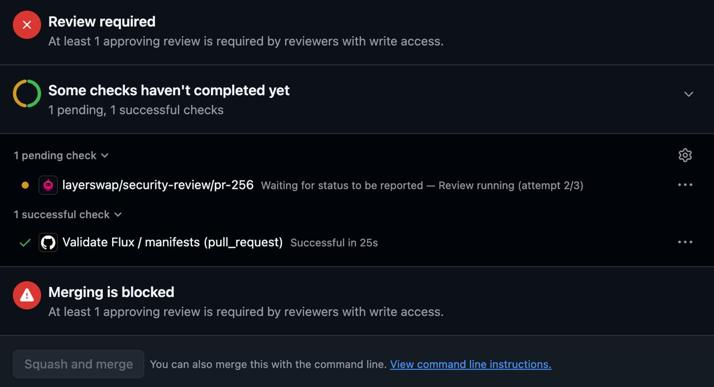
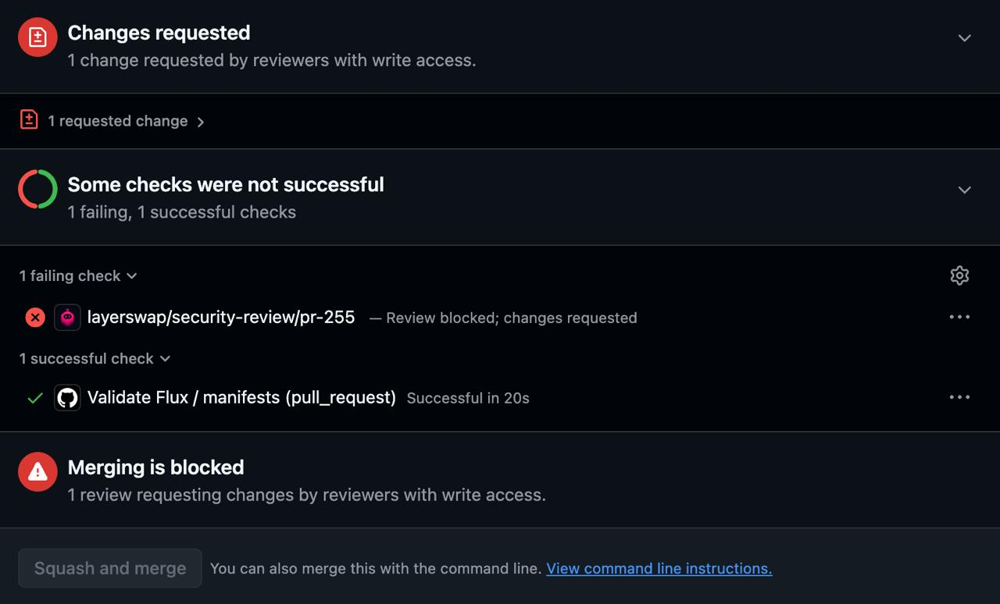
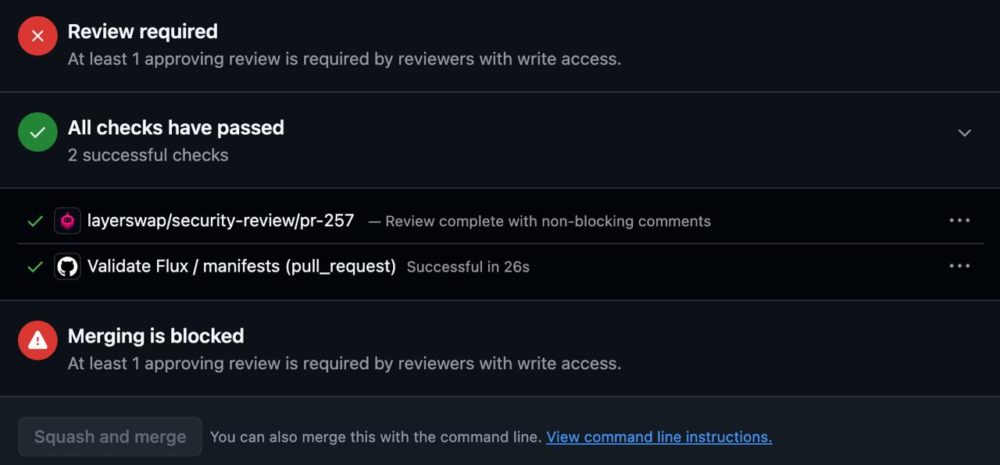

# xarnes-agent

**~500 LOC. One-click deployment. Full control. Your custom skills.**

`xarnes-agent` is a small, self-hosted pull-request review runner. It watches your GitHub repository
and uses [OpenAI Codex](https://learn.chatgpt.com/docs) or [Claude Code](https://code.claude.com/docs) to run your configured skill on each eligible
PR. Your skill chooses the checks, verdict, and complete review body. The runner posts the result:
`pass` approves, `comment` comments, and `block` requests changes.

[](https://render.com/deploy?repo=https://github.com/arkoc/xarnes)

## Why xarnes-agent

- **Easy to verify.** The whole runner is one [~600-line file](agent.mjs) using only Node.js built-ins.
  Read it end to end to see how credentials, reviews, retries, and delivery work.
- **Host it yourself.** Deploy to your Render account with one click, or run Docker on your own
  infrastructure. Your persistent volume holds the sign-ins, queue, and results.
- **Full control.** Choose the repository, branches, model, concurrency, and reviewer identity.
  Inspect and change the source, configuration, and saved state.
- **Your custom skills.** Set `SKILL` to a skill in your repository. It defines the review policy
  and the Markdown body to post; the runner handles execution, retries, and GitHub delivery.

## Deploy to Render

Click **Deploy to Render** and provide the five required environment values:

| Field | Value |
|---|---|
| `GITHUB_REPO` | `owner/name` of the repository to watch |
| `SKILL` | Directory in that repository holding `SKILL.md`, for example `skills/review` |
| `GITHUB_TOKEN` | Fine-grained token with **Contents: read**, **Pull requests: write**, **Commit statuses: write** |
| `STATUS_CONTEXT` | Review/check name, for example `security-review`. GitHub displays `security-review/pr-123` for PR #123 |
| `MAX_CONCURRENCY` | `1` to start. With the Codex engine each extra slot needs its own sign-in on this service's disk, so it is set per service and never overwritten by a Blueprint sync |

All optional watcher settings are declared in [render.yaml](render.yaml) and applied automatically.
Open your service's **Environment** page to see all 18 settings, including these defaults:

| Optional setting | Render default |
|---|---|
| `TARGET_BRANCHES` | `main,dev` |
| `MAX_ATTEMPTS` | `3` |
| `POLL_SECONDS` | `15` |
| `RUN_EXISTING` | `false` |
| `WATCH_UPDATES` | `true` |
| `ENGINE` | `codex` |
| `MODEL` | `gpt-6-sol` |
| `FAST_MODE` | `false` |
| `TASK_TIMEOUT_SECONDS` | `1800` |
| `SANDBOX` | `container` |
| `ALLOW_NETWORK` | `false` |
| `DATA_DIR` | `/data` |
| `CODEX_HOME` | `/data/codex` |
| `CLAUDE_CONFIG_DIR` | `/data/claude` |
| `CODEX_BIN` | `codex` |

Render's creation form prompts only for the five required values. To change optional settings
permanently, edit your fork's `render.yaml`: a later Blueprint sync can overwrite changes made on
the Environment page. Settings used only by local task mode are listed under Configuration below.

The default engine, Codex, uses your ChatGPT account: on first start, follow the sign-in link and
code in the logs for each configured slot. Sign-ins run one at a time; polling starts after all slots
are authenticated. To review with Claude Code instead, see [Engines](#engines): it takes a token
instead of a sign-in step.
No shell access is needed.

The [Render blueprint](render.yaml) builds the Dockerfile as a background worker with a persistent
1 GB disk at `/data`. The GitHub token and the engine's saved sign-in live on your Render service.

If you fork this repository, update the button above to point to your fork.
Render builds directly from the repository; no published image is required.

## How it works

```
 every 15 s ─► list open PRs ─► keep non-draft PRs into TARGET_BRANCHES ─► queue new heads
                                                                                │
                              ┌─────────────────────────────────────────────────┘
                              ▼   (up to MAX_CONCURRENCY at once, one engine process each)
   fetch HEAD + target ─► merge-base = BASE ─► checkout HEAD, worktree BASE ─► load skill from BASE
                              │
                              ▼
   codex exec  ◄── skill path, repo, PR number, BASE, HEAD, PR metadata file
                              │  returns JSON: verdict, body
                              ▼
   validate ─► save result + marker ─► recheck PR ─► POST review ─► commit status
```

1. **Discover.** Every `POLL_SECONDS` the agent lists open pull requests and keeps the non-draft
   ones targeting `TARGET_BRANCHES`. A PR is queued when it is new, has a new head commit, or was
   retargeted. Discovery keeps running while reviews are in progress, so new work is never blocked
   behind a long review, and a finished review wakes the next scan immediately.
2. **Prepare.** For each queued PR the agent fetches the exact head and target commits, computes the
   merge base, checks out the head, and creates a second worktree at the merge base. The skill is
   loaded **from the merge base**, never from the PR, so a PR that edits the skill still gets
   reviewed by the skill the target branch had.
3. **Review.** The engine (Codex or Claude Code) runs non-interactively in its own process group,
   starting outside both checkouts with the repository's agent instructions and project settings
   disabled. It
   receives the skill path, repository, PR number, `BASE`, `HEAD`, and a metadata file with the PR
   title and description, which the prompt marks as untrusted data. It never receives the GitHub
   token.
4. **Validate.** The response must be a JSON object with a verdict of `pass`, `comment`, or `block`,
   and a non-empty `body` string. The skill decides the verdict and writes the complete review.
   Nothing is posted for a malformed result.
5. **Deliver.** The validated result is saved to the volume with a unique marker **before** anything
   is posted. The agent then re-reads the PR (still open, same head, same base, not a draft),
   submits the review bound to the reviewed commit, and updates the commit status. If the response
   is lost, the next scan finds the marker on GitHub and does not post again.
6. **Retry.** Failed review execution uses backoff (5, 10, 20, 40 minutes, capped at 60) until
   `MAX_ATTEMPTS` is spent. Interrupted runs retry on restart when attempts remain; a graceful
   stop does not consume an attempt. GitHub delivery failures retry the saved result without
   rerunning the engine or consuming review attempts.

## What developers see

A status check named `<STATUS_CONTEXT>/pr-<number>` appears in the PR's checks section. The agent
publishes it as a GitHub commit status and updates it automatically as the review progresses:

| Stage | Status check | GitHub review action |
|---|---|---|
| Waiting for a worker | 🟡 Pending: Queued for review | No review posted yet |
| Picked up by a worker | 🟡 Pending: Review running (attempt n/N) | No review posted yet |
| Review finished, delivery pending | 🟡 Pending: Review finished; posting the result | Posting or confirming delivery of the review |
| Result `pass` | ✅ Success: Review passed | Approves the PR and posts the review report |
| Result `comment` | ✅ Success: Review complete with non-blocking comments | Posts the review report with comments, without approval |
| Result `block` | ❌ Failure: Review blocked; changes requested | Requests changes and posts the review report with blocking findings |
| Retry scheduled | 🟡 Pending: Review failed; retry scheduled | No final result yet |
| Engine usage limit reached | 🟡 Pending: `<Engine>` usage limit reached; review will retry automatically | Not an attempt; reviews pause 15 minutes, then resume |
| Retry budget exhausted | ⚠️ Error: operator action needed | Delivery has not completed |
| Superseded revision or closed PR | ⚠️ Error: superseded or cancelled | No new review posted for the ineligible revision |

For a passing review, the sequence is **queued → running → posting the review → approved + check
passed**. The final success or failure status is published only after GitHub confirms the review
was posted (or the agent finds an already-posted review when reconciling a retry). The report is
the body of that approval, comment, or change request; it is not a separate duplicate PR comment.

The skill writes the complete review body, including any headings, icons, tables, evidence, and
commit references. The runner posts it with credential redaction and a hidden delivery marker,
without adding visible formatting.

### Examples on GitHub

**Running.** The check is pending and shows the current attempt. Required approval remains
outstanding while the agent reviews the PR.



**Changes requested.** A blocking verdict posts a change request and marks the check as failed.
In this example, the repository's review rules also block merging.



**Passed with comments.** A non-blocking comment verdict marks the check as passed and posts the
review comments. It does **not** approve the PR, so GitHub can still show **Review required** and
**Merging is blocked**, as in this example. A `pass` verdict submits an approval instead.



These statuses are informational: their names include the PR number, so they cannot serve as one
reusable required status check for the branch. To gate merging on reviews, configure required
approvals and **dismiss stale approvals** in your branch rules. GitHub does not let a token approve
its owner's own PRs, so use a dedicated reviewer identity.

## Run it yourself

```sh
docker build -t xarnes-agent:local .
cp agent.env.example agent.env   # set GITHUB_REPO, SKILL, GITHUB_TOKEN, STATUS_CONTEXT
chmod 600 agent.env
```

Sign in once, or skip this and follow the link the watcher prints on first start:

```sh
docker run --rm -it --no-healthcheck --env-file ./agent.env -v my-agent:/data xarnes-agent:local login
```

Watch:

```sh
docker run -d --name pr-agent --stop-timeout 15 --restart unless-stopped \
  --log-driver local --log-opt max-size=10m --log-opt max-file=3 \
  --env-file ./agent.env -v my-agent:/data xarnes-agent:local watch

docker logs -f pr-agent
```

Reuse the same volume on every run: it holds the sign-in, the state file, and the saved results.
Run exactly one watcher per volume; the container holds a lock on it and refuses a second owner.
With `MAX_CONCURRENCY=N` on the Codex engine, each slot has its own home (`/data/codex`,
`/data/codex-2`, …) and its own sign-in; `login` signs in every slot that lacks one, `login 2` re-signs
one slot. Slots
signed in with the same ChatGPT account share its rate limit, so concurrency buys wall-clock time,
not quota.

One-off run against a local checkout, without GitHub (no review is posted):

```sh
docker run --rm -v my-agent:/data -v "$PWD:/workspace" -e SKILL=skills/review xarnes-agent:local task
```

Task mode runs the explicitly configured `SKILL`. For a free-form task, set `INSTRUCTIONS` or
`INSTRUCTIONS_FILE` (see [instructions.example.md](instructions.example.md)) and leave `SKILL` unset.
Any edits remain in the mounted workspace.

## Engines

`ENGINE` selects which CLI performs the review. Everything else — discovery, the merge-base skill,
validation, exactly-once delivery, statuses, retries, and the usage-limit pause — is identical.

| | `codex` (default) | `claude` |
|---|---|---|
| Runs | `codex exec` | `claude -p --output-format json` |
| Sign-in | ChatGPT device sign-in, one per slot, started from the logs on first run | `CLAUDE_CODE_OAUTH_TOKEN` (one-year subscription token from `claude setup-token` on a workstation) or `ANTHROPIC_API_KEY`; there is no device flow |
| Slots | each slot has its own Codex home and sign-in | one credential and one `CLAUDE_CONFIG_DIR` serve every slot; concurrency is bounded by the plan's rate limit |
| Keeping the PR's config out | `--ignore-user-config --ignore-rules`, no `AGENTS.md`, cwd outside both checkouts | `--setting-sources user`, `--add-dir <checkout>`, cwd outside both checkouts; a `CLAUDE.md` inside an added directory is not loaded |
| Sandbox | container boundary, or Codex's inner sandbox via `SANDBOX` | container boundary (`--permission-mode bypassPermissions`); `MAX_BUDGET_USD` caps spend per review |
| Usage limit | *"You've hit your usage limit"* | `is_error` with *usage limit*, *weekly limit*, *rate limit*, *Too Many Requests* (429), *spend limit* or *credit balance* in `result` |

Both engines receive the same prompt and must return the same JSON verdict, so a skill written for
one runs unchanged on the other. Model quality is a separate question; compare on a test PR before
switching a production repository.

### Switching a service to Claude Code

1. **Create the token once, on your own machine** (it needs a browser and a terminal):

   ```sh
   claude setup-token
   ```

   Sign in with the Claude account whose subscription should pay for the reviews. The command
   prints a token valid for one year. Keep it like a password; it is the whole credential.

2. **Set three environment variables on the service** (Render: *Environment* page; Docker: `agent.env`):

   ```dotenv
   ENGINE=claude
   CLAUDE_CODE_OAUTH_TOKEN=<the token>
   MODEL=claude-opus-5-5
   ```

   Leave `MODEL` empty for Claude's default, or use `claude-sonnet-5` for faster, cheaper reviews.
   `FAST_MODE` is ignored; `MAX_BUDGET_USD` optionally caps spend per review. `MAX_CONCURRENCY` needs
   no extra sign-ins: every slot uses the same token. An API key in `ANTHROPIC_API_KEY` works instead
   of the token, billed at API rates.

3. **Redeploy.** The watcher starts immediately; there is no sign-in step. Without a token it exits
   with a message naming exactly this variable.

4. **Check the first review** in the logs (`Running PR … Claude Code slot 1`) and on the PR. The
   status check and the review body look the same as with Codex; only the reviewer differs.

Switching back is the same three variables the other way (`ENGINE=codex`, a Codex `MODEL`). The
Codex sign-ins stay on the disk untouched while Claude Code is in use; if one expired meanwhile, run
`login` once or delete that slot's `auth.json` and restart to get a fresh sign-in link in the logs.

## Configuration

Everything is an environment variable. `agent.env.example` is a commented starting point.
The table lists the runner's defaults when variables are absent. The Render blueprint and local
example explicitly select `gpt-6-astra` with `FAST_MODE=true`.

| Variable | Default | Purpose |
|---|---|---|
| `GITHUB_REPO` | required | Repository to watch, `owner/name`. Its presence selects `watch` when no command is given |
| `SKILL` | required | Skill directory in that repository; a bare name means `skills/<name>` |
| `GITHUB_TOKEN` | required | GitHub credential, supplied as an environment variable |
| `TARGET_BRANCHES` | `main` | Comma-separated base branches; only non-draft PRs into these are reviewed |
| `STATUS_CONTEXT` | required | Commit-status check name; the agent appends `/pr-<number>` |
| `MAX_CONCURRENCY` | `1` | Reviews run in parallel; Codex needs one sign-in per slot, Claude Code shares one credential |
| `MAX_ATTEMPTS` | `3` | Attempts per head commit before the failure becomes terminal |
| `POLL_SECONDS` | `15` | Discovery interval and minimum delivery-retry delay; integer ≥ 15 |
| `RUN_EXISTING` | `false` | Also review PRs already open on the first scan |
| `WATCH_UPDATES` | `true` | Review new head commits on already-reviewed PRs |
| `ENGINE` | `codex` | Review engine: `codex` or `claude` (see Engines) |
| `MODEL` | engine default | Model override, passed to the engine's `--model` |
| `FAST_MODE` | `false` | Codex only: `true` requests the Fast tier (more ChatGPT credits, if available for the model) |
| `MAX_BUDGET_USD` | none | Claude Code only: hard spend cap per review, passed to `--max-budget-usd` |
| `CLAUDE_CODE_OAUTH_TOKEN` / `ANTHROPIC_API_KEY` | none | Claude Code credential: a subscription token from `claude setup-token`, or an API key (API billing) |
| `TASK_TIMEOUT_SECONDS` | `1800` | Limit for one engine run; the whole process group is killed on expiry |
| `SANDBOX` | `container` in the image | `container` trusts the container boundary; `read-only` / `workspace-write` use Codex's inner sandbox (Codex only) |
| `ALLOW_NETWORK` | `false` | Network access for skill commands in `workspace-write` mode |
| `DATA_DIR` | `/data` | Volume root: sign-ins, state, results, checkouts |
| `CODEX_HOME` | `$DATA_DIR/codex` | Slot 1's Codex home; slot N uses `<CODEX_HOME>-N` |
| `CODEX_BIN` | `codex` | Codex executable |
| `CLAUDE_CONFIG_DIR` | `$DATA_DIR/claude` | Claude Code home, shared by every slot |
| `CLAUDE_BIN` | `claude` | Claude Code executable |
| `WORKSPACE` | `/workspace` | Task mode: the checkout to run against |
| `SKILLS_DIR` | `$WORKSPACE/skills` | Task mode: where bare skill names are resolved |
| `INSTRUCTIONS` / `INSTRUCTIONS_FILE` | none | Task mode: free-form prompt instead of a skill |

Credentials are read at startup; restart after rotating them. The image runs as the non-root `node`
user and pins its Node base image by digest and both engine CLIs by version.

## The skill contract

Configure `SKILL` with the directory of the skill you want the runner to execute, for example
`SKILL=skills/your-review`. That directory must contain `SKILL.md` and any references it needs,
committed to the repository being reviewed. Your configured skill owns the review policy, the
verdict, and the complete review body.
Its final response must be a JSON object with two required fields, without Markdown fences or
surrounding text:

```json
{
  "verdict": "block",
  "body": "## Changes requested\n\nThe endpoint allows anonymous writes. Restore the authorization check."
}
```

- `verdict`: exactly `pass`, `comment`, or `block`.
- `body`: a non-empty string containing the complete GitHub review in Markdown.

| Verdict | GitHub review | Commit status |
|---|---|---|
| `pass` | `APPROVE` | success |
| `comment` | `COMMENT` | success |
| `block` | `REQUEST_CHANGES` | failure |

These are the only required fields. Extra fields are ignored. The runner validates the verdict
and body, then posts the skill's Markdown using the matching GitHub review action.

The runner posts `body` with credential redaction and a hidden marker for duplicate prevention.
The JSON response is saved under `/data/runs/*.json`. The runner's 60,000-byte publishing limit
includes the marker; oversized reviews fail rather than truncate. Skills should keep their bodies
below this limit.

## Reliability notes

- **State** lives in `/data/prs-OWNER--REPO.json`: per PR the reviewed head, base, attempt count,
  result path, marker, and delivered review id. Writes are fsynced and atomically renamed. Invalid
  state stops startup without changing the file. Closed PRs retain completed and pending review
  records so reopening can reuse a saved result or recognize an already-posted review. Other
  closed-PR records are removed.
- **Concurrency is one process.** Workers share the process; the state file and GitHub status
  writes are serialized; a PR never has two reviews in flight, so a new head on an active PR waits.
- **Status delivery** posts directly to GitHub. Retrying after a lost response may add an identical
  entry to the commit's status history. Review delivery still checks its marker to avoid duplicate reviews.
- **Engine usage limit.** When Codex prints "You've hit your usage limit", or Claude Code returns a
  429 / usage, weekly, rate or spend limit error, the run is not counted
  against `MAX_ATTEMPTS`: the PR's status says the limit was reached, every slot pauses for 15
  minutes, and the same attempt is retried when the pause ends. Nothing is escalated to an operator
  for a limit that resets on its own.
- **Healthcheck** (`node /app/agent.mjs healthcheck`) is a liveness check: the discovery loop ticked
  within `max(2 min, 3 × POLL_SECONDS)`. A failing GitHub scan logs `Poll failed` but is not
  "unhealthy", because a restart would not fix it.
- **Shutdown** on `SIGTERM` aborts GitHub calls, signals every engine process group, escalates to
  `SIGKILL` after five seconds, and marks interrupted runs for immediate retry without spending an
  attempt. Allow at least 15 seconds for graceful shutdown.
- **Storage:** `codex[-N]/` holds sign-ins, `runs/` saved results, `prs-*.json` watcher state, and
  `agent.lock` the single-owner lock. Each review uses temporary checkouts under `workspaces/`;
  both snapshots and their Git history are removed after success or failure. Startup clears any
  checkouts left by a crash. Saved results have no automatic expiry. Allow space for
  `MAX_CONCURRENCY × (repository history + two working trees)`, plus saved results and engine data.

## Security notes

The skill is loaded from the merge base. Skill files and any symlink targets are trusted; the runner
does not scan or restrict symlinks. Engine workers do not receive the GitHub token; only the wrapper
fetches and publishes. Review bodies, saved results, and logs redact the exact `GITHUB_TOKEN` value;
other credentials and encoded tokens are not redacted. The default `SANDBOX=container` trusts the
container as the boundary: skill commands run as the same user as the wrapper, with the volume and
network reachable. Use this for
repositories you control. Reviewing hostile or public pull requests needs workers isolated from the
publisher and its credentials.

## Repository layout

| File | What it is |
|---|---|
| [`agent.mjs`](agent.mjs) | The runner. Everything described above |
| [`Dockerfile`](Dockerfile) | Node + Git + the Codex and Claude Code CLIs, non-root, `tini` + `flock` entrypoint |
| [`agent.env.example`](agent.env.example) | Commented configuration template |
| [`render.yaml`](render.yaml) | Deploy to Render blueprint |
| [`.github/workflows/ci.yml`](.github/workflows/ci.yml) | Runs tests and builds the Docker image locally in CI; does not publish or deploy |
| `*.test.mjs` | Tests: local Git fixtures, fake engine binaries, a mocked GitHub API. No network, no credentials |

## Tests

```sh
node --test --test-timeout=120000 agent.test.mjs reviews.test.mjs lifecycle.test.mjs status.test.mjs
```

Tests cover the verdict mapping, skill-written bodies, delivery reconciliation across restarts and
lost responses, retries and backoff, concurrency, queue persistence, status transitions, shutdown,
crash recovery, state validation, and first-start sign-in from the logs. They use temporary
directories and mocked services; no network or credentials are needed.

References: [Codex documentation](https://learn.chatgpt.com/docs),
[Claude Code documentation](https://code.claude.com/docs),
[skills](https://learn.chatgpt.com/docs/build-skills),
[GitHub reviews API](https://docs.github.com/en/rest/pulls/reviews),
[GitHub commit statuses](https://docs.github.com/en/rest/commits/statuses).
